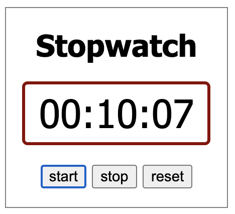

# {{ title }}	

> #### Voorkennis:  
> * JS basics

> #### Doelen:  
> * JS Interval leren gebruiken
> * Globale variabelen toepassen

Bekijk de basis opzet van de stopwatch [std.stegion.nl](https://std.stegion.nl/cs_codebase/js17_stopwatch/).

### opdracht
* neem het de basis functionaliteit van de tutorial over en test het
* maak een "start"-button aan en koppel die aan een function <i>fStart()</i> (test deze met een console.log())
* laat <i>mijnInterval</i> als globale variabel staan, plaats <i>setInterval()</i> in <i>fStart()</i>
* maak een "reset"-button en function aan die de seconden weer op 0 zet en de interval stopt
* Zorg dat de tijd in minuten, seconden en honderste-seconden wordt weergegeven
    * zet de interval tijd op 10ms zodat je de honderste-seconden telt
    * als de seconden &gt; 59 worden, moet de weer op 00 staan en de minuten op 01
    * als seconden of minuten &lt; 9 zijn moet er een 0 voor staan: 08, 09, 10, 11..
* voeg CSS toe om het mooier te maken

     
    <video  height="180px" controls>
        <source src="https://std.stegion.nl/cs_codebase/js17_stopwatch/mp4/stopwatch_plain.mp4" type="video/mp4" >
        Your browser does not support the video tag.
    </video>

### verder uitbreiden met CSS
* ga eventueel verder met opdracht [css17_stopwatch](../css17-or-stopwatch/) waarin je met CSS de stopwatch er zo uit laat zien:

<video  height="179" controls>
    <source src="https://std.stegion.nl/cs_codebase/js17_stopwatch/mp4/stopwatch_img.mp4" type="video/mp4" >
    Your browser does not support the video tag.
</video>